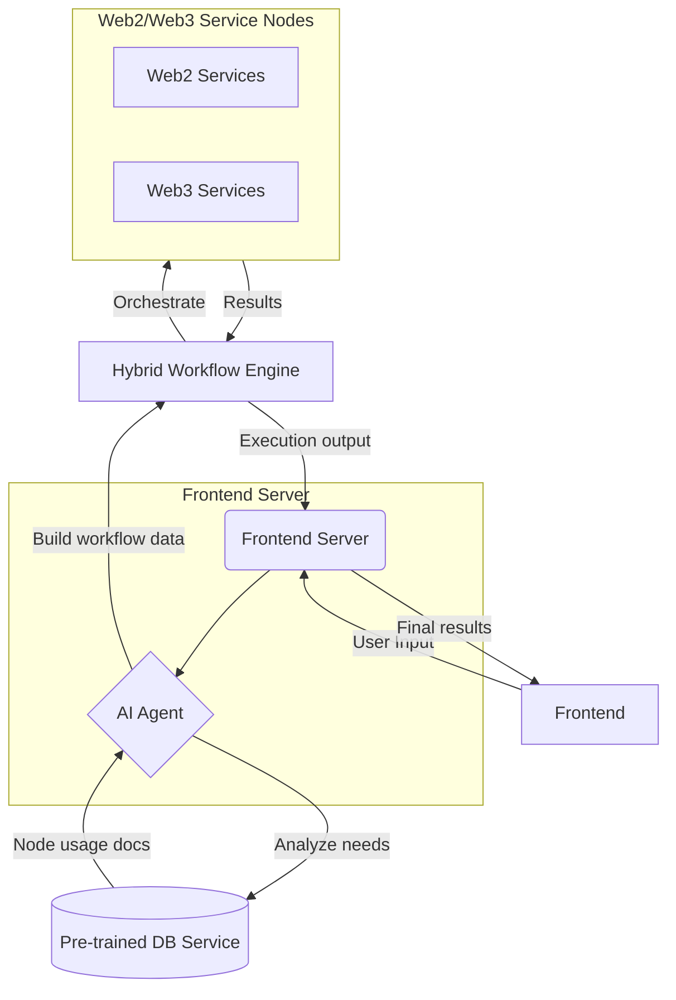

The web interface section of [https://app.kamechan.xyz]

This is a small part of the code open for hackerson and has not yet been fully open-sourced.

The workflow engine part is under heavy development, and not open sourced yet 

**Architecture**

